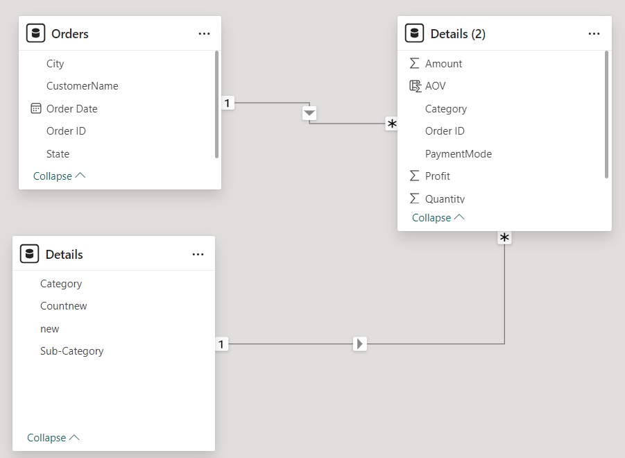
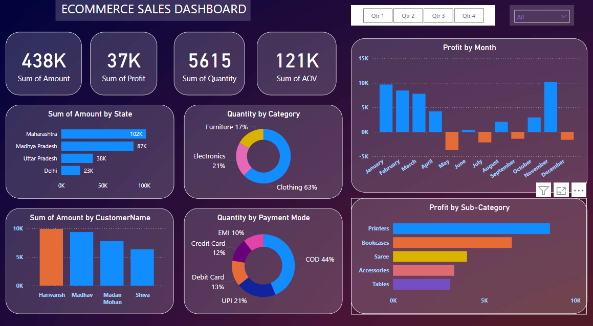

# Madhav Ecommerce Store - Sales Analysis
---

## Introduction
This project is a comprehensive eCommerce sales analysis of **Madhav Ecommerce Store** conducted using Power BI. 
This is aimed at helping businesses gain valuable insights into their sales performance. By visualizing key metrics and trends, the dashboard enables data-driven decision-making, improving business strategies and overall profitability.

**_Disclaimer_**: _All datasets and reports do not represent ay company, institution or country, but just a dumy datasets to demonstrate usefullness of PowerBI._

## Problem statement
1. Which category of goods is most purchased in terms of quantity ?
2. What is the profit in each subcategory of goods ?
3. What are the revenues and total profit of each quarter also each months ?
4. What is the total average order value ?

## Skills and Concepts demonstrated

The following PowerBI features were incorporated:

- Power Query,
- DAX,
- Modelling,
- Filters,
- Visulization Tools,
- tooltips

## Modelling:
Automatically derived relationships are adjusted to remove and replace unwanted relationships with the required.

Model
:-------:

There are 2 dimension tables and 1 fact table. The dimension tables are all joined to the fact table with a one-to-many relationship.

## Analysis:

 **Sales Overview**
   
   Total Sales Amount: The total revenue generated is 438K. This gives an overall view of the 
  financial health of the business.
  
  Total Profit: The total profit amounts to 37K. This indicates the margin over the total sales 
  and can be used to evaluate profitability.
  
  Total Quantity Sold: A total of 5615 units were sold, indicating the volume of transactions.
  
  Average Order Value (AOV): The sum of AOV (Average Order Value) is 121K, which helps in 
  understanding customer spending behavior on average per order.

 **Sales by Region**
 
  Top Performing States:
  Maharashtra is the leading state with sales of 102K, followed by Madhya Pradesh with 87K, and 
  Uttar Pradesh with 38K.
  Delhi has the lowest sales among the listed states with 23K.
  This regional breakdown can help target marketing and inventory efforts more effectively in 
  higher-performing areas.

 **Sales by Customer**
   
  Top Customers:
  Harivansh appears to be the highest spender, followed closely by Madhav, Madan Mohan,and 
  Shiva. Understanding high-value customers can assist in creating loyalty programs and 
  personalized.

 **Product Category and Sub-Category Analysis**
 
  Quantity by Category:
  Clothing leads the sales with 63%, followed by Electronics at 21%, and Furniture at 17%.
  This breakdown helps in identifying which product categories are driving the most sales.

  Profit by Sub-Category:
  Printers are the most profitable sub-category, followed by Bookcases, Sarees, Accessories, 
  and Tables.
  Focusing on these sub-categories could lead to higher profitability, while underperforming 
  sub-categories might require review or discontinuation.

 **Payment Mode Analysis**
 
  Popular Payment Methods:
  COD (Cash on Delivery) is the most preferred payment method, accounting for 44% of 
  transactions, followed by UPI at 21%.
  Other methods include Debit Card (13%), Credit Card (12%), and EMI (10%).
  This insight can help optimize the payment options offered and improve the checkout 
  experience.

 **Monthly Profit Analysis**
 
  Profit Trends by Month:
  May and December are the most profitable months, with significant spikes in profit, while 
  months like June and August show a decline in profitability.
  Seasonal trends and promotional strategies might be affecting these figures, and such 
  insights can help in planning for future sales campaigns.

